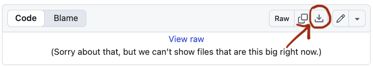
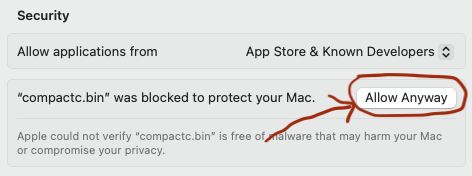

# Compact Toolchain Prereleases

This directory contains prerelease versions of the Compact toolchain, which includes the Compact compiler.
These are versions that are publicly available but not yet ready to install via the Compact developer tools (or "devtools", the `compact` command-line tool).

**Prerelease versions are intended for users who really, really need to test an about-to-be-released version of the toolchain.**
If you are not such a user, you should stick to officially released (and supported) versions that can be installed via the devtools.

## Versions

Prerelease binaries are in directories corresponding to releases.
For example, you will find prerelease binaries for Compact toolchain 0.27 in the directory `compactc-0.27`.
The binaries have version numbers ending with `-rc.x` ("release candidate", where _x_ is the release candidate number).

Binaries are provided for x86-64 Linux (`x86_64-unknown-linux-musl`),
Apple silicon macOS (`aarch64-darwin`),
and x86-64 macOS (`x86_64-darwin`).

## Installation Instructions

Prerelease versions are provided as platform specific `.zip` files.
You can download and unzip this anywhere, but it's simplest to let the Compact devtools manage it as a version that you can switch to.
To install a prerelease version for devtools, follow the manual installation process:

1. Download the `.zip` file for your architecture and OS using the "Download raw file" button in the GitHub UI.
   

1. Create the directory that the devtools expects for the release.
   For example, if you are using the default devtools location (`.compact` in your home directory) and for 0.27.0-rc.1 for Apple silicon macOS:
   ```
   mkdir -p ~/.compact/versions/0.27.0-rc.1/aarch64-darwin
   ```
   `-p` is the option to tell `mkdir` to create all the parent directories if they do not already exist.
   Be careful to get this command right because the devtools will look in a specific location based on the version string.
   If you are not sure about the platform name, look at how it is spelled for some of the officially released versions.

1. Unzip the downloaded binary in this new directory.
   For example, continuing with 0.27.0-rc.1 for Apple silicon macOS (and the version downloaded to `Downloads` in your home directory):
   ```
   unzip ~/Downloads/compactc_v0.27.0-rc.1_aarch64-darwin.zip -d ~/.compact/versions/0.27.0-rc.1/aarch64-darwin
   ```
   Tip: you can probably use tab completion for the `.zip` file name and the version directory.

1. Use `compact update` to **locally** create all the symbolic links the devtools needs to invoke the tools.
   Again, continuing the 0.27.0-rc.1 example:
   ```
   compact update 0.27.0-rc.1
   ```
   You will see something like `compact: aarch64-darwin -- 0.27.0-rc.1 -- already installed` because you have already downloaded and unzipped the `.zip` file.

The toolchain consists of multiple binaries
(`format-compact` is the formatter,
`fixup-compact` is the fixup tool,
`zkir` is used by the compiler to generate prover and verifier keys,
`compactc.bin` is the compiler binary but you should invoke this via the shell script `compact`).

**IMPORTANT:** On macOS these binaries are not signed so the OS will initially block them from running.
When you see a dialog box about them, choose "Done" (do not move them to the trash).
Then open the "Privacy & Security" System Settings.
Scroll down to the bottom of the settings and you will see, for example, `"compactc.bin" was blocked to protect your Mac.`.
Click "Allow Anyway".


You will have to do this for each binary the first time you use it (note that the compiler binary automatically invokes the `zkir` binary if it needs to generate keys).
